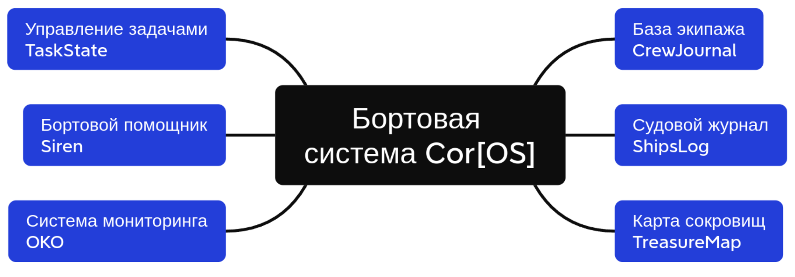
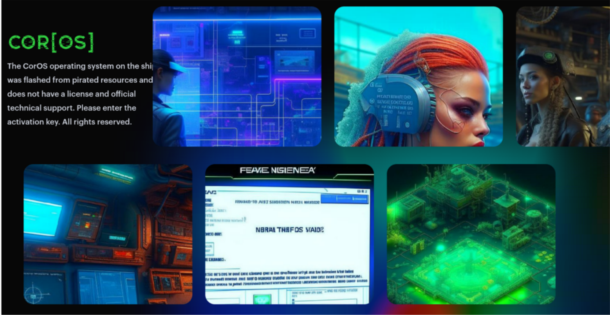

# SxCTF.Corsairs 2023

Турнир прошел 19 сент 2023 г.

Репозиторий содержит исходный код сервисов и чекеров.

## Легенда

19 сентября – международный пиратский день

2123 год н.э.
Человечество уверенно вышло в космос покоряя всё новые и новые горизонты. Машины прочно вошли в обиход и помогают человеку в решении повседневных задач – готовят, убирают, присматривают за питомцами. Голод, болезни и нищета остались в глубоком прошлом и даже Аналитическая Система Моделирования Единой Теории Астероидов наконец начала работать стабильно.

Однако цивилизация распространилась пока ещё не во все уголки Вселенной и где-то ещё остались пережитки прошлого в виде феодализма, неравного распределения ресурсов и, как следствие, преступности и, в частности, пиратства.

Каждая команда представляет собой экипаж космического челнока – участника имитационных боёв между пиратами.

Сервисы входят в состав бортовой системы CorOS космического челнока. Система CorOS на корабле была перепрошита с пиратских ресурсов, не имеет лицензии и официальной техподдержки.

## Бортовая система Cor[OS]

## Сервисы

| Service | Checker | Author rep |
|---------|---------|------------|
| **[TaskState](services/taskstate/)** | [Checker](checkers/task_state_checker/) | [Rep](https://github.com/almorozov/taskstate) |
| **[Siren](services/siren/)** | --- | [Rep](https://github.com/andreika47/Siren) |
| **[CrewJournal](services/crewjournal/)** | [Checker](checkers/crew_journal_checker/) | [Rep](https://github.com/1121977/ctf-II) |
| **[ShipsLog](services/shipslog/)** | [Checker](checkers/ships_log_checker/) | [Rep](https://github.com/Lustredusol1/homework) |
| **[OKO](services/oko/)** | [Checker](checkers/oko_checker/) | [Rep](https://github.com/lejkaxdd/oko) |
| **[TreasureMap](services/treasuremap/)** | [Checker](checkers/treasure_map_checker/) | [Rep](https://github.com/TheMostofTheMost/ctf-treasure-map-service) |

## Инфраструктура

- Жюрейная система: [ForcAD](https://github.com/pomo-mondreganto/ForcAD)

## Тех.стек сервисов CTF
Docker + Docker Compose
Apache Tomcat, NGINX
Python, Flask + Jinja2, SQLAlchemy
Java, Spring, Maven
SQLite, PostgreSQL, RedisGraph, MariaDB, MongoDB
